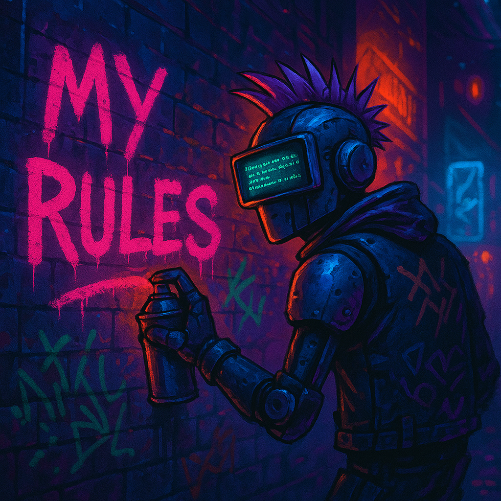

# My Rules

This repository contains personal coding conventions and best practices across multiple technologies. The goal is to provide a portable set of rules that can be easily included in any project without being tied to specific file structures, naming schemes, or domains.

## Philosophy

- Keep projects clean by separating *how you write code* from *what the project is*.
- Avoid polluting new codebases with inconsistent or project-specific style decisions.
- Enable fast ramp-up in Cursor or any editor by loading your preferred rules per technology.

## Structure

Each `.mdc` file represents conventions for a specific technology or stack (e.g., `react.mdc`, `python.mdc`, `nextjs-app-router.mdc`).

Files can be imported, linked, or embedded in project onboarding docs, documentation sites, or developer notes.

## Versions

If you need different versions of a technology, you can make a new file with the same name but with a different version number. eg. `react.mdc` and `react-19.mdc`. It might be useful to have a symlink to the latest version...

---

## To Do

Add the following files:

- [x] `react.mdc`
- [x] `nextjs-app-router.mdc`
- [x] `typescript.mdc`
- [x] `python.mdc`
- [x] `nodejs.mdc`
